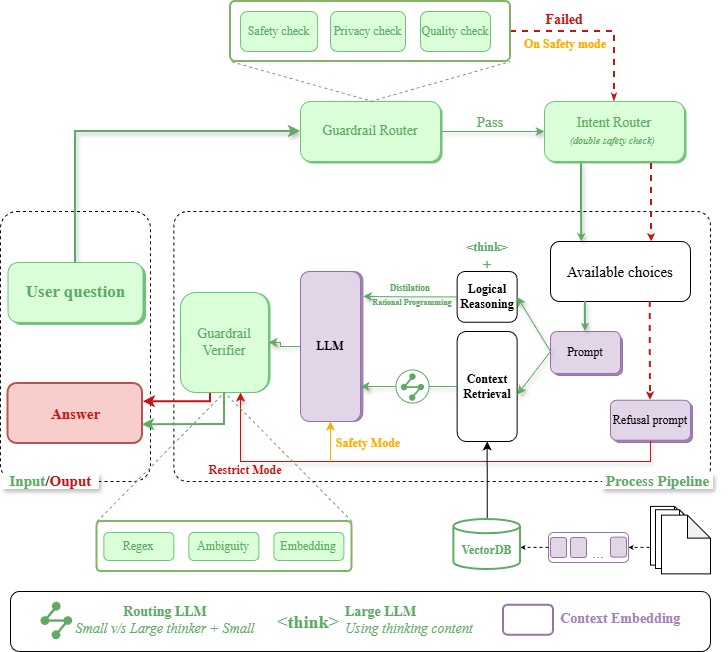

# VNPT AI QA System - AIO-Hitman

Hệ thống Hỏi đáp Tự động (QA System) sử dụng kiến trúc RAG (Retrieval-Augmented Generation) kết hợp với Router thông minh và quy trình suy luận đa bước (Multi-step Reasoning) để giải quyết các câu hỏi trắc nghiệm đa lĩnh vực.

## 1. Pipeline Flow

Sơ đồ luồng xử lý của hệ thống:

### Sơ đồ luồng xử lý (Architecture)



**Mô tả chi tiết:**
1.  **Input Processing**: Câu hỏi được kiểm tra an toàn (Safety Check) để loại bỏ nội dung độc hại (Toxicity/Politics).
2.  **Intent Routing**: Phân loại câu hỏi thành các nhóm: *Math/Logic* hoặc *Knowledge/Reading*.
3.  **Knowledge Path (RAG)**:
    *   Truy vấn dữ liệu từ Qdrant VectorDB.
    *   Đánh giá độ tin cậy của tài liệu tìm được.
    *   Nếu tài liệu tốt: Sử dụng Small LLM trả lời nhanh (Tiết kiệm chi phí).
    *   Nếu tài liệu kém: Kích hoạt Large LLM để suy luận sâu (Reasoning) bổ sung kiến thức nội tại.
4.  **Solvers Path (Logic)**:
    *   Sử dụng Large LLM để tạo chuỗi suy luận (Chain-of-Thought).
    *   Sử dụng 3 Small LLM đóng vai các Giám khảo khác nhau để bỏ phiếu chọn đáp án đúng nhất (Voting Ensemble).
5.  **Final Verification**: Kiểm tra lại định dạng và tính hợp lý của đáp án trước khi xuất kết quả.

## 2. Data Processing

Quy trình xử lý dữ liệu được thực hiện qua module `src/etl`:

1.  **Thu thập dữ liệu (Crawling)**:
    *   Sử dụng `src/crawler` để tải văn bản pháp luật và Wikipedia.
    *   Công cụ: `Trafilatura` để extract content sạch, loại bỏ các thành phần rác của HTML.

2.  **Làm sạch & Chuẩn hóa (Cleaning)**:
    *   Xóa bỏ các citation marker (`[1]`, `[edit]`), các link rác.
    *   Chuẩn hóa encoding và định dạng Markdown.
    *   Logic nằm trong `src/etl/chunkers.py` -> `_clean_wiki_content`.

3.  **Phân mảnh (Chunking)**:
    *   Sử dụng **Semantic Chunking**: Cắt văn bản dựa trên cấu trúc ngữ nghĩa (Chương, Điều, Khoản).
    *   **Context Injection**: Mỗi chunk con đều được gắn kèm Tiêu đề và Context của văn bản mẹ để đảm bảo ngữ nghĩa độc lập khi tìm kiếm.
    *   Độ dài chunk tối đa: 8192 characters (hoặc tùy chỉnh để phù hợp context window).

4.  **Embedding**:
    *   Sử dụng mô hình embedding qua API (`vnptai_hackathon_embedding`).
    *   Dữ liệu được vector hóa và chuẩn hóa dimension.

## 3. Resource Initialization

Hướng dẫn khởi tạo tài nguyên để chạy pipeline:

### Bước 1: Cài đặt môi trường
```bash
pip install -r requirements.txt
```

### Bước 2: Ingestion (Khởi tạo Database)
Chạy script ETL để xử lý dữ liệu thô và đẩy vào Qdrant:
```bash
# Script này sẽ tự động:
# 1. Đọc data từ src/etl/dataset
# 2. Chunking & Embedding
# 3. Tạo Collection '360_xinchao' trong Qdrant và upload vectors.
python src/etl/ingest.py
```
*Lưu ý: qdrant được lưu dưới dạng sqlite storage tại `qdrant_data` folder. Main Collection là 360_xinchao*

### Bước 3: Chạy Inference
Sau khi có Database, chạy script dự đoán trên tập test:
```bash
# Mặc định sẽ tìm file /code/private_test.json hoặc args.data
python predict.py --data dataset/test.json
```

Kết quả sẽ được lưu tại:
*   `submission.csv`: File nộp bài (id, answer).
*   `submission_time.csv`: File theo dõi thời gian (id, answer, time).

### Bước 4: 
Notes: Ngoài các module cơ bản, còn một module nữa về caching, nó được lưu tại `dataset/semantic_cache.pkl`
- Ý tưởng của module này là để giảm thiểu lượng query gửi ra Qdrant, khi có query trùng lặp, ta sẽ tìm kiếm trong cache trước, nếu có thì trả về kết quả ngay, không cần query lại Qdrant. Các thông tin, logical process được verify sử dụng validation set.
- Target rằng, tối ưu dựa trên validation, chứ không cố gắng build massive qdrant database, điều này sẽ đảm bảo đánh giá hiệu quả nhất với chất lượng mô hình sinh
- Cách tiếp cận của tôi dựa trên thực nghiệm từ các nghiên cứu trước + Agent hiện tại đang được users sử dụng, răng càng nhỏ càng tốt (nhỏ mà có võ), vậy nên cách tiếp cận sẽ được triển khai theo hướng Distillation, nhằm học các tri thức từ một mô hình lớn cho các tác vụ reasoning phức tạp, còn để các tác vụ đơn giản thì để các mô hình nhỏ tự thân.
- Routing models: Các mô hình được nén onnx và lưu tại `models/` để không bị lệ thuộc vào các thay đổi về môi trường. Chi tiết xem tại `config.json`